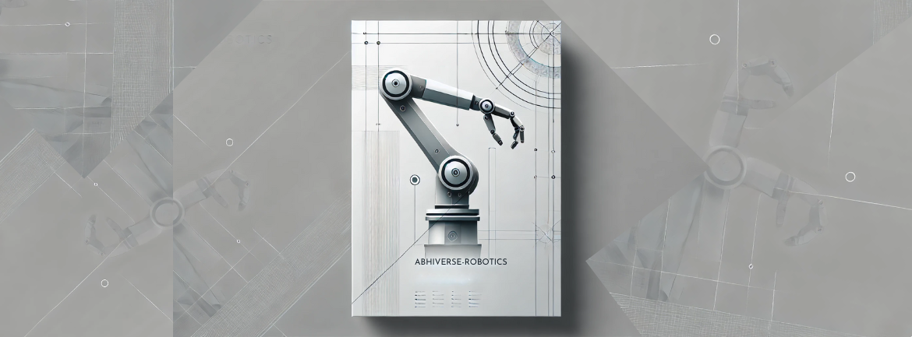

# Welcome to Abhiverse01-org! 🤖🌌
## Hi there 👋

**Here are some ideas to get you started:**

🙋‍♀️ We are robotics enthusiasts aiming to build a robotics ecosystem. 
👩‍💻 Useful resources - Entire resources and documentation for all projects are pinned in their respective readme in the badges section.
🍿 Fun facts - I like Pencils, and robots made of pencils, I have built a lot of bots with pencils.
🧙 Remember, you can do mighty things with the power of Robotics & Automation


[](https://github.com/abhiverse01-org)
[](https://github.com/abhiverse01-org)
[](https://github.com/abhiverse01-org/.github/blob/main/LICENSE)

## About Us

Welcome to **Abhiverse01-org**! We are a passionate team dedicated to advancing the field of robotics and robotics simulation. Our organization is directed by [abhiverse01](https://github.com/abhiverse01), who plays a pivotal role in steering our projects and innovations.

## Our Projects 🚀

### Robotics Projects 🤖

We work on a variety of cutting-edge robotics projects, ranging from autonomous vehicles to robotic arms. Our projects aim to push the boundaries of what's possible with modern robotics technology.

### Robotics Simulation 🖥️

Simulation is a crucial part of our work. We develop and utilize sophisticated simulation environments to test and refine our robotic systems. This helps us to improve the reliability and efficiency of our robots in real-world applications.

# Getting Started 🏁

## Prerequisites
🌈 Contribution guidelines - how can the community get involved?

To get started with our projects, you will need to have the following installed:

- Python 3.x
- ROS (Robot Operating System)
- Gazebo Simulation Environment
- Other dependencies specified in the individual project repositories

## Installation

- Clone any of our repositories and follow the instructions in the README files to set up the projects on your local machine. Here's an example for one of our repositories:

```bash
git clone https://github.com/abhiverse01-org/your-project.git
cd your-project
pip install -r requirements.txt
```

## Contributing 🤝

- We welcome contributions from the community! If you are interested in contributing, please follow these steps:

- Fork the repository you want to contribute to.
- Create a new branch (git checkout -b feature/your-feature).
- Make and commit your changes (git commit -m 'Add some feature').
- Push to the branch (git push origin feature/your-feature).
- Open a pull request.

## Community and Support
- Join our community to stay updated and get support:

## GitHub Discussions
- Slack Channel
- Twitter

## License 📄
- This project is licensed under the MIT License. See the LICENSE file for details.

## Acknowledgements 🙏
- We would like to thank all the contributors and supporters of our projects. Special thanks to the open-source community for providing invaluable resources and tools.


